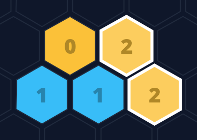
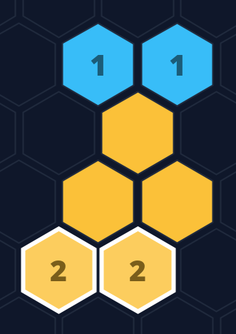
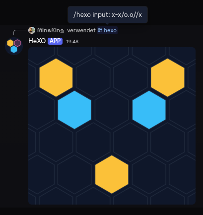
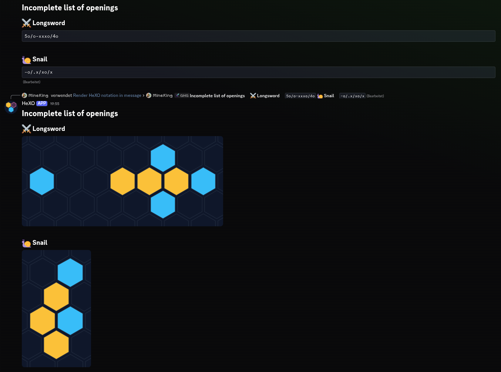
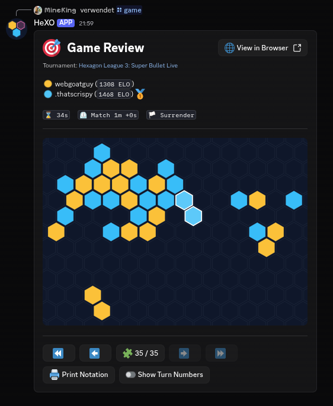

<h1>HeXO Renderer</h1>
HeXO Renderer is a small Discord bot written in Kotlin for rendering rectilinear <a href="https://hexo.did.science">HeXO</a> notation within Discord.

## Invite
Add HeXO Renderer to your server or user account: [Invite HeXO Renderer](https://discord.com/oauth2/authorize?client_id=1496214901713014894).

## Table of Contents
<!-- TOC -->
  * [Invite](#invite)
  * [Table of Contents](#table-of-contents)
  * [Notation](#notation)
    * [Rectilinear Notation](#rectilinear-notation)
    * [BKE Notation](#bke-notation)
    * [Combined](#combined)
  * [Features](#features)
    * [Command `hexo`](#command-hexo)
    * [Message command](#message-command)
    * [Command `game`](#command-game)
  * [Contributing](#contributing)
  * [Build](#build)
<!-- TOC -->

## Notation
### Rectilinear Notation
Rectilinear notation is a notation for encoding board states used by the community to quickly write down formations in text messages. 
However, it can become hard to reason about for more complex states. To solve this issue, this bot provides a way to render this notation as an image directly from within Discord.

The general syntax has the following characters:

| Character | Meaning                                               |
|-----------|-------------------------------------------------------|
| x         | Player 1 (Red / Yellow)                               |
| o         | Player 2 (Blue)                                       |
| .         | Empty cell                                            |
| -         | Two empty cells (equivalent to `..`)                  |
| /         | New row. A newline character can also be used instead |

It is also possible to use numbers to indicate the number of empty cells, so the following are equivalent: `x...x`, `x-.x`, `x3x`.

The following image is produced by the notation `x-x/o.o//x`:


Or for a more complex example:
```
. . x
 . o o
  . x x x o
   x x . o .
```


It is also possible to highlight cells. For player characters you can use uppercase letters and for empty cells `!`:

| Default Character | Highlighted Variant |
|-------------------|---------------------|
| x                 | X                   |
| o                 | O                   |
| .                 | !                   |

Additionally, winning rows (6 or more in a row) are highlighted automatically.

`...!/...x/oxxxxxx/.oox/ooox/.o.o`


### BKE Notation
The bot can also render a variation of BKE notation. This is especially useful if you want turn numbers to be displayed on the rendered tiles.

The basic idea of BKE notation is dividing the board in rings (identified by letters starting from 'A') around the origin and addressing cells using a ring and offset. For this to work, a zero offset line is required.
Even though the zero offset line is not required to identify a formation on an empty board, it is relevant to know in which orientation the formation should be rendered. 
Also, when applying BKE on a non-empty board, the origin and zero offset line become vital to avoid ambiguity.

To encode the zero offset line, the actual BKE notation can be prefixed with one of these indicators: `->`, `\>`, `</`, `<-`, `<\`, `/>` representing one of the right, bottom right, bottom left, left, top left or top right zero offset lines.
If no direction is specified, `/>` is used implicitly.
It is also optionally possible to specify the direction (chirality) in which to step from that zero offset line by adding `CCW` or `CW`, for counterclockwise and clockwise respectively, behind the direction prefix.
If no chirality is specified, the value will default to clockwise.

For example, `</ CCW o A0 A1 x A2 B3` renders as follows:



To avoid long offset values, you can optionally use sector addressing. 
For this, the board is split into 6 sectors divided by the possible zero offset lines. Using `sector.offset` you can use a sector-relative offset.
For example, `</ CCW o A0 A1 x A2 B1.1` would be equivalent to the example before.

### Combined

It is also possible to combine rectilinear notation with BKE notation. This is useful if you want to encode an initial state and the moves made from that point on.
For that you just write `<rectilinear>, <bke>` with each part following the corresponding rules stated above. The BKE origin will be the top left cell by default. 
You can change this by adding a `@(q, r)` before the actual BKE notation, where q and r define the axial coordinates of the new origin relative to the top left corner.

The following are equivalent: 
- `.x/xx, <\ @(1,0) o A0 A1 x B3.1 B3.2`
- `.x/xx, /> o A0 B1 x B2.0 B2.1`



## Features
### Command `hexo`
Accepts HeXO notation as parameter and renders it as image. Example usage:



### Message command
It is also possible to render notation in existing messages. To do so, right-click the message and select `Apps > HeXO Renderer > Render HeXO notation in message`:



### Command `game`
Another feature is reviewing games from https://hexo.did.science in Discord. Simply use the `game` slash command and provide a game id (or link) to the game you want to review:



## Contributing
Contributions are very welcome.
If you have a small or medium improvement, feel free to open a PR directly.
For larger changes, please open an issue first so we can align on scope and approach.

## Build
If you want to build (and run) the bot yourself, you can run `./gradlew discord:shadowJar`, which will create `discord/build/libs/discord-[version]-all.jar`. 
You can then run this jar with `java -jar path-to.jar`.

> [!NOTE]
> You need a JDK 21 (or higher) installed to build the jar. To run it, a JRE is sufficient.

Alternatively you can use the `Dockerfile` to build a docker image that you can run.
In both cases the environment variable `TOKEN` has to be set to the bot token of your discord bot.
